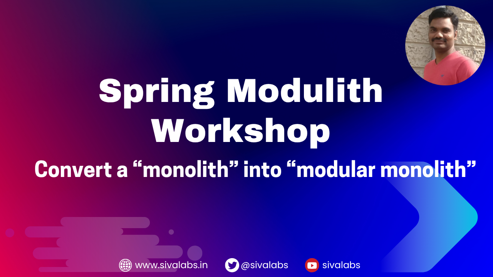

# Spring Modulith Workshop
A bookstore application currently following the **package-by-layer** code organization.

In this workshop, we will refactor this application to follow Modular Monolith architecture 
using [Spring Modulith](https://spring.io/projects/spring-modulith).



## Prerequisites
* JDK 21 or newer
* Docker and Docker Compose
* Your favourite IDE (Recommended: [IntelliJ IDEA](https://www.jetbrains.com/idea/))

Install JDK, Maven using [SDKMAN](https://sdkman.io/)

```shell
$ curl -s "https://get.sdkman.io" | bash
$ source "$HOME/.sdkman/bin/sdkman-init.sh"
$ sdk install java 21.0.1-tem
$ sdk install maven
```

Pulling docker images may take some time, so it's better to pull them before the workshop begins.

```shell
$ docker pull postgres:17-alpine
$ docker pull rabbitmq:4.0.6-management
$ docker pull rabbitmq:4.0.6-alpine
$ docker pull openzipkin/zipkin:3.4.4
```

## Workshop Outline

[1. Understand existing code](workshop/step-1.md)
[2. Follow package-by-feature](workshop/step-2.md)
[3. Add Spring Modulith support](workshop/step-3.md)
[4. Understand OPEN type modules](workshop/step-4.md)
[5. Understand NamedInterfaces](workshop/step-5.md)
[6. Verify module boundary violations](workshop/step-6.md)
[7. Verify module circular dependency violations](workshop/step-7.md)
[8. Explicit module dependencies](workshop/step-8.md)
[9. Event Driven Communication](workshop/step-9.md)
[10. Testing modules in isolation](workshop/step-10.md)
[11. Create C4 Model documentation](workshop/step-11.md)
[12. Conclusion](workshop/step-12.md)
