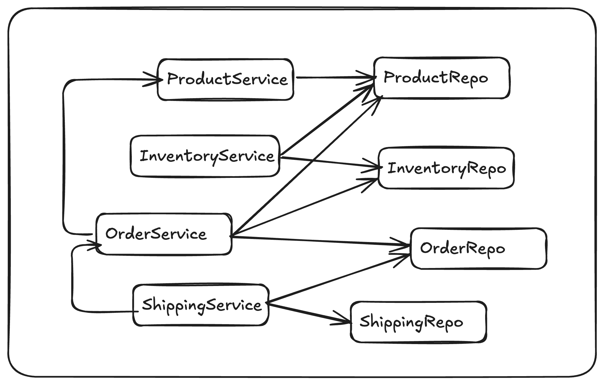

# 1. Understand existing code

## Project Local Setup

```shell
$ git clone https://github.com/sivaprasadreddy/spring-modulith-workshop.git
$ cd spring-modulith-workshop
$ ./mvnw clean verify
```

The current code organization follows **package-by-layer**.

```
bookstore
  |-- config
  |-- entities
  |-- exceptions
  |-- models
  |-- repositories
  |-- services
  |-- web
```

## Package-by-layer Issues
1. The code structure doesn't express what the application is about.
2. Need to make every class as `public` which allows accessing them from everywhere.
3. This leads to spaghetti code.
4. Adding a new feature or modifying an existing feature may break other features.

### Tightly Coupled Code


### Goal: Modular Code


## Recommendation
1. Follow package-by-feature.
2. Make a class `public` only when it's necessary.

<p align="center">
[Previous: Home](../README.md) &nbsp;&nbsp;&nbsp;&nbsp;
[Next: 2. Follow package-by-feature](step-2.md)
</p>