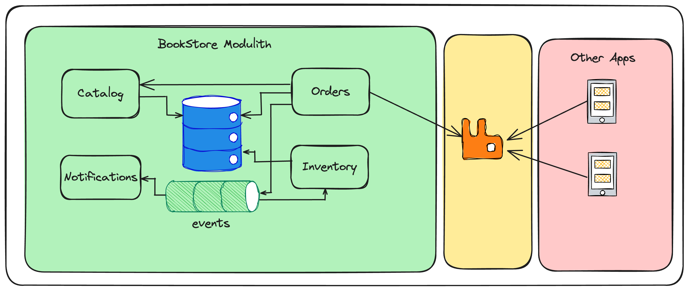

# Conclusion

The refactored application now follows modular monolith architecture with the following modules:

* **Common:** This module contains the code that is shared by all modules.
* **Catalog:** This module manages the catalog of products and store data in `catalog` schema.
* **Orders:** This module implements the order management and store the data in `orders` schema.
* **Inventory:** This module implements the inventory management and store the data in `inventory` schema.

**Goals:**
* Implement each module as independently as possible.
* Prefer event-driven communication instead of direct module dependency wherever applicable.
* Store data managed by each module in an isolated manner by using different schema or database.
* Each module should be testable by loading only module-specific components.

**Module communication:**

* **Common** module is an OPEN module that can be used by other modules.
* **Orders** module invokes the **Catalog** module public API to validate the order details
* When an Order is successfully created, **Orders** module publishes **"OrderCreatedEvent"**
* The **"OrderCreatedEvent"** will also be published to external broker like RabbitMQ. Other applications may consume and process those events.
* **Inventory** module consumes "OrderCreatedEvent" and updates the stock level for the products.

[Previous: 11. Create C4 Model documentation](step-11.md) &nbsp;&nbsp;&nbsp;&nbsp;
[Home](../README.md)

