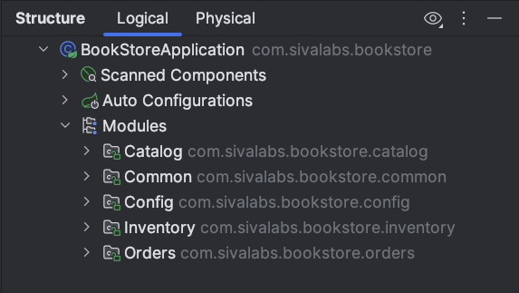
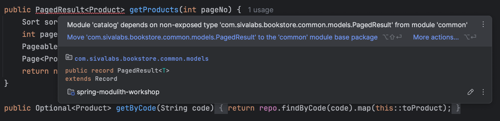

# 3. Add Spring Modulith support

## Add Spring Modulith dependencies

```xml
<properties>
    <spring-modulith.version>1.4.3</spring-modulith.version>
</properties>

<dependencyManagement>
    <dependencies>
        <dependency>
            <groupId>org.springframework.modulith</groupId>
            <artifactId>spring-modulith-bom</artifactId>
            <version>${spring-modulith.version}</version>
            <type>pom</type>
            <scope>import</scope>
        </dependency>
    </dependencies>
</dependencyManagement>

<dependencies>
    <!-- other dependencies -->
    <dependency>
        <groupId>org.springframework.modulith</groupId>
        <artifactId>spring-modulith-starter-core</artifactId>
    </dependency>
    
    <dependency>
        <groupId>org.springframework.modulith</groupId>
        <artifactId>spring-modulith-starter-test</artifactId>
        <scope>test</scope>
    </dependency>
</dependencies>
```

## IntelliJ IDEA Support for Spring Modulith

Module Indicators in the package structure:


Modules view in the Structure toolwindow:



## Understand Spring Modulith concepts
* Top-level Modules
* Nested Modules
* Provided Interface (Expose Public API)
* Internal Implementation Components
* Required Interface (Dependencies on other Modules)
* ApplicationModules Types
  * Simple
  * Advanced
  * Open/Closed

## Create a ModularityTest class

```java
package com.sivalabs.bookstore;

import org.junit.jupiter.api.Test;
import org.springframework.modulith.core.ApplicationModules;

class ModularityTest {
    static ApplicationModules modules = ApplicationModules.of(BookStoreApplication.class);

    @Test
    void verifiesModularStructure() {
        modules.verify();
    }
}
```

Now run this test, and it will fail.

You can see all the violations of modular structure in the console output.

```shell
- Module 'catalog' depends on non-exposed type com.sivalabs.bookstore.common.models.PagedResult within module 'common'!

- Module 'inventory' depends on non-exposed type com.sivalabs.bookstore.orders.domain.models.OrderCreatedEvent within module 'orders'!
...
...
```

## IntelliJ IDEA shows violations in the editor


[Next: 4. Understand OPEN type modules](step-4.md)