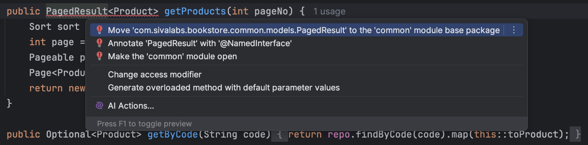

# 4. Understand OPEN type modules
An `OPEN` type module is a module that exposes all its types, including sub-packages, to other modules.

```shell
- Module 'catalog' depends on non-exposed type com.sivalabs.bookstore.common.models.PagedResult within module 'common'!

.....
.....
```

**Make `common` module `OPEN` type module.**

Add `package-info.java` in `com.sivalabs.bookstore.common` package with the following content:

```java
@ApplicationModule(type = ApplicationModule.Type.OPEN)
package com.sivalabs.bookstore.common;

import org.springframework.modulith.ApplicationModule;
```

**Using IntelliJ IDEA, apply the quick-fix:**



Run `ModularityTest`.


[Previous: 3. Add Spring Modulith support](step-3.md) &nbsp;&nbsp;&nbsp;&nbsp;
[Next: 5. Understand NamedInterfaces](step-5.md)
