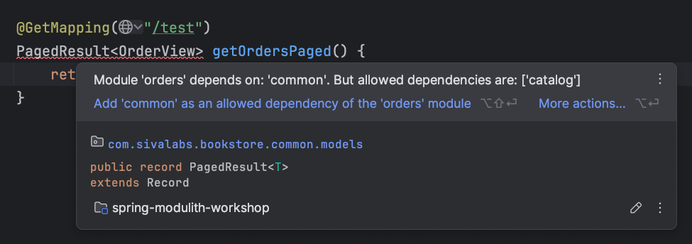
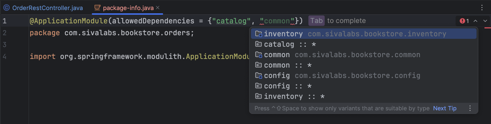

# 8. Explicit module dependencies

By default, a module can depend on any other module if there are no circular dependencies.
But we can explicitly specify module dependencies to restrict dependency on a specific set of modules.

Add `package-info.java` in `com.sivalabs.bookstore.orders` package with the following content:

```java
@ApplicationModule(allowedDependencies = {"catalog"})
package com.sivalabs.bookstore.orders;

import org.springframework.modulith.ApplicationModule;
```

Add the following API endpoint in `OrderRestController.java`:

```java
@GetMapping("/test")
PagedResult<OrderView> getOrdersPaged() {
    return null;
}
```



Run ModularityTest:

```shell
org.springframework.modulith.core.Violations: - Module 'orders' depends on module 'common' via com.sivalabs.bookstore.orders.web.OrderRestController -> com.sivalabs.bookstore.common.models.PagedResult. Allowed targets: catalog.
```

You can explicitly specify `common` module as a dependency of `orders` module.`




[Previous: 7. Verify module circular dependency violations](step-7.md) &nbsp;&nbsp;&nbsp;&nbsp;
[Next: 9. Event Driven Communication](step-9.md)
